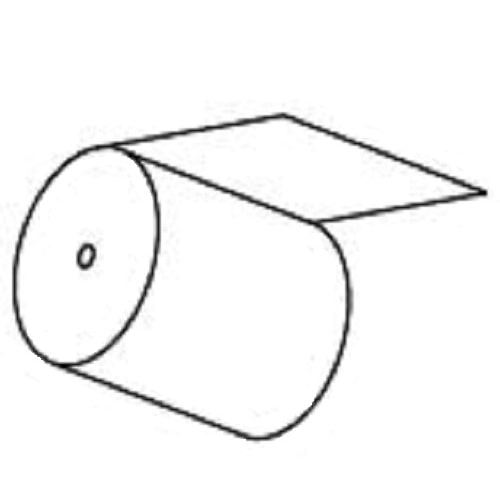

# Contrastive Learning

Using contrastive learning to improve transformer based language and visual models. 
The repository contains procedures to train the models using various ways to apply contrastive learning. 
The two tasks are text classification (meddra) and image classification (sketch).   

## Meddra short text classification
Fine-Tuning BERT to classify short sequences of texts in one of the 24.000 PT classes (medical terms). 

The major problem in the training process is that for many of the classes very few examples are available.

| text  | class |
| ------------- | ------------- |
| dull pain in head | headache  |
| pain in muscles  | myalgia |
| stomach ache  | abdominal pain upper |

## Hypernym classification from images
Using contrastive learning and the Google Visual Transformer to improve classification of objects in sketches exploiting wordnet and imagenet datasets.

By using contrastive learning on images that need to be classified into the same class imagenet instances can be used to augment the training process for the task of sketch object classification.
